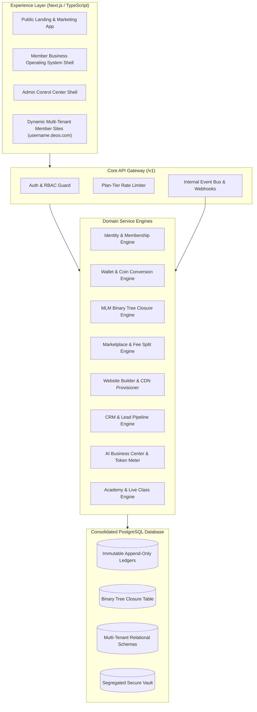
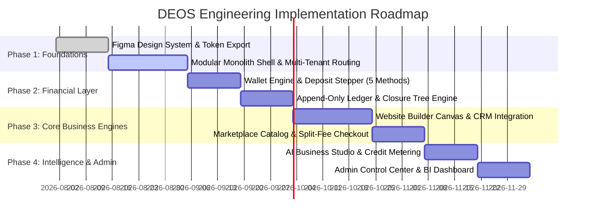

# DEOS — Digital Entrepreneurship Operating System
# Master Product & Technical Framework Guide
### Authoritative Blueprint for Antigravity AI, Engineering, and Figma Design Teams

**Document Status:** Governing Master Specification  
**Governed By:** Book 0 (Product Constitution & Core Architecture)  
**Target Systems:** Frontend Framework (React/Next.js/TypeScript), Design System (Figma), Backend API (Modular Monolith), Multi-Tenant Engine, Database (PostgreSQL/Closure Tables), Security & Financial Ledger  
**Associated Artifacts:** 16 Architecture Books (Books 0–15), 19 UI/UX Master Screenshots (`UIUX pictures/`)

---

## Table of Contents
1. [Executive Summary & Constitutional Hierarchy](#1-executive-summary--constitutional-hierarchy)
2. [The Golden Invariants (Zero-Mistake Rules)](#2-the-golden-invariants-zero-mistake-rules)
3. [Multi-Tenant Framework Architecture](#3-multi-tenant-framework-architecture)
4. [Universal Figma Design System & Token Specification](#4-universal-figma-design-system--token-specification)
5. [Complete Screenshot-to-Framework-to-Figma Matrix (19 Screens)](#5-complete-screenshot-to-framework-to-figma-matrix-19-screens)
   - [Screen 1: Member Dashboard (`user dashboard.PNG`)](#screen-1-member-dashboard-user-dashboardpng)
   - [Screen 2: Admin Control Center (`admin dashboard.PNG`)](#screen-2-admin-control-center-admin-dashboardpng)
   - [Screen 3: Binary Network Tree & BV Visualizer (`binary network.PNG`)](#screen-3-binary-network-tree--bv-visualizer-binary-networkpng)
   - [Screen 4: Wallet Deposit & Coin Conversion Flow (`deposit.PNG`)](#screen-4-wallet-deposit--coin-conversion-flow-depositpng)
   - [Screen 5: Wallet Management & Allocation (`wallet dashboard.PNG`)](#screen-5-wallet-management--allocation-wallet-dashboardpng)
   - [Screen 6: Marketplace Home & Catalog (`marketplace home.PNG`)](#screen-6-marketplace-home--catalog-marketplace-homepng)
   - [Screen 7: Seller & Partner Center Dashboard (`sellers dashboard.PNG`)](#screen-7-seller--partner-center-dashboard-sellers-dashboardpng)
   - [Screen 8: Website Builder Drag-and-Drop Visual Studio (`website builder.PNG`)](#screen-8-website-builder-drag-and-drop-visual-studio-website-builderpng)
   - [Screen 9: AI Business Center & Studio Catalog (`AI tools.PNG`)](#screen-9-ai-business-center--studio-catalog-ai-toolspng)
   - [Screen 10: CRM Dashboard, Pipeline & Lead Intelligence (`734AC24A-0E81-4DAC-ADEC-2503710B230C.PNG`)](#screen-10-crm-dashboard-pipeline--lead-intelligence-734ac24a-0e81-4dac-adec-2503710b230cpng)
   - [Screen 11: Marketing Center & Multichannel Automation (`marketing tools.PNG`)](#screen-11-marketing-center--multichannel-automation-marketing-toolspng)
   - [Screen 12: Digital Entrepreneur Academy & Student Hub (`learninng dashboard.PNG`)](#screen-12-digital-entrepreneur-academy--student-hub-learninng-dashboardpng)
   - [Screen 13: Events, Webinars & Masterclasses (`event & webinar.PNG`)](#screen-13-events-webinars--masterclasses-event--webinarpng)
   - [Screen 14: Team Management & Staff RBAC (`team.PNG`)](#screen-14-team-management--staff-rbac-teampng)
   - [Screen 15: User & Business Profile Settings (`user settings.PNG`)](#screen-15-user--business-profile-settings-user-settingspng)
   - [Screen 16: Support & Community Help Desk (`support & community.PNG`)](#screen-16-support--community-help-desk-support--communitypng)
   - [Screen 17: Platform Analytics & BI Insights (`analysis overview.PNG`)](#screen-17-platform-analytics--bi-insights-analysis-overviewpng)
   - [Screen 18: Public Marketing Landing Page (`36D46F56-CEFA-4D8F-B36D-881B73005B9E.PNG`)](#screen-18-public-marketing-landing-page-36d46f56-cefa-4d8f-b36d-881b73005b9epng)
   - [Screen 19: Admin Sub-Panels: User, Staff & System Config (`6A189D5F-D81F-4DD0-92E2-0F2426AF4CB6.PNG`)](#screen-19-admin-sub-panels-user-staff--system-config-6a189d5f-d81f-4dd0-92e2-0f2426af4cb6png)
6. [Compensation, Math & Financial Ledger Engine](#6-compensation-math--financial-ledger-engine)
7. [API & Database Contract Specification](#7-api--database-contract-specification)
8. [Anti-Pattern & Error Prevention Catalog for AI Agents](#8-anti-pattern--error-prevention-catalog-for-ai-agents)
9. [Phased Technical Implementation Strategy](#9-phased-technical-implementation-strategy)

---

## 1. Executive Summary & Constitutional Hierarchy

The **Digital Entrepreneurship Operating System (DEOS)** is an integrated all-in-one business operating system. Instead of forcing entrepreneurs to subscribe to and integrate disconnected SaaS tools (website builders, hosting, CRM, payment processors, course platforms, affiliate networks, and AI writing tools), DEOS collapses the entire stack into **one unified, multi-tenant ecosystem**.

```
┌──────────────────────────────────────────────────────────────────────────────────┐
│                      CONSTITUTIONAL HIERARCHY OF TRUTH                           │
├──────────────────────────────────────────────────────────────────────────────────┤
│ 1. Book 0 (Product Constitution & Core Architecture) — SUPREME LAW              │
│ 2. Book 1 (Executive Vision) & Master Technical Guide (This Document)            │
│ 3. Specialized Domain Books (Books 2–14)                                         │
│ 4. Verified UI/UX Screenshots (`UIUX pictures/`)                                 │
│ 5. Future Expansion Roadmap (Book 15 — Deferred until gates are cleared)         │
└──────────────────────────────────────────────────────────────────────────────────┘
```

> **Strict AI Directive**: When implementing any frontend component, API endpoint, or database migration, cross-reference this document first. If any mockup or prompt implies behavior that contradicts Book 0 or this Guide, this Guide and Book 0 prevail.

---

## 2. The Golden Invariants (Zero-Mistake Rules)

To ensure zero divergence between design (Figma), documentation (Books), and code (Framework), every engineer and AI agent must enforce these invariants:

1. **Book 0 is the Supreme Law**:
   - No feature, design component, or database mutation may violate Book 0 principles.
2. **Single Multi-Tenant Engine (No Siloed Sites)**:
   - DEOS is **one centralized multi-tenant platform**. We do *not* provision separate codebases or databases for each user. Member websites are rendered dynamically from a centralized rendering engine backed by `member_sites` and `site_content` configurations.
3. **DEOS Coin Value Model**:
   - **Launch State (Admin-Controlled Floating Unit / Model B)**: DEOS Coin is the platform's internal unit of value. Its exchange rate is platform-managed and logged immutably in `coin_rate_history`. Real-money deposits (USDT, Card, Bank, Mobile Money) convert into DEOS Coin at the confirmed locked rate.
   - **UI Rule**: Rates are displayed with a live quote-refresh mechanism and countdown timer (e.g., 15-minute lock). No speculative crypto ticker widgets are displayed on utility store checkouts.
4. **Onboarding & Registration Pipeline (6 Stages)**:
   - `Free Registration` $\rightarrow$ `Account Created` $\rightarrow$ `Wallet Activated` $\rightarrow$ `Deposit Funds` $\rightarrow$ `Convert to DEOS Coin` $\rightarrow$ `Purchase Membership Plan ($100 Launch / $300 Growth / $500 Legacy)` $\rightarrow$ `Business Launch Wizard (15 Steps)`.
5. **Exact Compensation Math**:
   - **Binary Commission**: **Flat 10%** of weaker leg Business Volume (BV). (Corrects the 15% UI placeholder in older mockups).
   - **Direct Referral Commission**: $25 (Launch), $75 (Growth), $125 (Legacy).
   - **Generation Bonus**: 2nd Generation = 30% of Direct Bonus; 3rd Generation = 15% of Direct Bonus.
   - **Marketplace Upline Override**: **3% of the promoter's earned commission** (deducted from promoter pool, not added to seller fee).
   - **Split Commission**: When an under-qualified sponsor refers a higher-tier member, the unearned difference splits 50% to Platform Sustainability Fund and 50% to nearest qualified upline. If no qualified upline exists, 100% routes to Platform Sustainability Fund.
6. **Append-Only Immutable Ledger**:
   - Tables (`wallet_transactions`, `commission_ledger`, `binary_volume_events`, `treasury_fund_ledger`) are strictly append-only. No `UPDATE` or `DELETE` queries on financial records. Reversals or corrections are recorded as distinct reversing entries.
7. **Dual-Condition Write Requirement**:
   - Financial mutations require (1) a valid client action trigger AND (2) an asynchronous, cryptographically verified server-side receipt from the payment processor / blockchain node before ledger crediting.
8. **Lead Attribution Immutability**:
   - When a visitor enters via a member's personal website (`username.deos.com` or custom domain) or affiliate link, lead source attribution (`site_id`, `member_id`, `referral_code`) is permanently recorded and immutable in the CRM.
9. **AI Transparency & Editability**:
   - All AI-generated outputs (content, images, code, ad copy) must carry an explicit AI attribution tag and require user review before publishing to live sites or campaigns.

---

## 3. Multi-Tenant Framework Architecture

DEOS is structured as a high-performance **Modular Monolith** with clean domain boundaries.



### Multi-Tenancy Resolution Strategy
- **Routing & Subdomains**: `middleware.ts` extracts the hostname.
  - If `admin.deos.com` $\rightarrow$ routes to Admin Platform.
  - If `app.deos.com` $\rightarrow$ routes to Member Dashboard.
  - If `{subdomain}.deos.com` or custom CNAME $\rightarrow$ resolves `tenant_id` from `member_sites` and renders the dynamic site template.
- **Data Isolation**: All database queries for tenant data filter by `member_id` / `tenant_id` at the repository layer.

---

## 4. Universal Figma Design System & Token Specification

The DEOS design system uses a dark sidebar with a light canvas (`#F8FAFC`) to maximize readability, contrast, and executive polish.

```
┌─────────────────────────────────────────────────────────────────────────────────┐
│                                FIGMA DESIGN TOKENS                              │
├─────────────────────────────────────────────────────────────────────────────────┤
│ Primary Accent     : #4F46E5 (Indigo 600) | Hover: #4338CA | Glow: #6366F1     │
│ Background Canvas  : #F8FAFC (Slate 50)   | Card Surface: #FFFFFF               │
│ Dark Sidebar Nav   : #0B0F19 (Navy Black) | Active Item: #4F46E5               │
│ Border & Dividers  : #E2E8F0 (Slate 200)  | Dark Border: #1F2937               │
│ Text Colors        : #0F172A (900 Main)   | #475569 (600 Muted) | #94A3B8 (Dim)│
│ Functional Colors  : Success #10B981 | Warning #F59E0B | Error #EF4444         │
│                      Info #3B82F6    | Purple #8B5CF6  | Cyan #06B6D4          │
│ Typography         : Inter / Plus Jakarta Sans (-0.02em letter spacing)         │
│ Radius Scale       : sm: 8px | md: 12px | lg: 16px | xl: 24px | pill: 9999px    │
│ Shadows            : Card: 0 1px 3px 0 rgba(0,0,0,0.05), 0 1px 2px -1px ...    │
└─────────────────────────────────────────────────────────────────────────────────┘
```

### Global Navigation Shell Specs (Desktop & Mobile)
- **Desktop Left Rail**: Width `260px`, Background `#0B0F19`, Fixed position.
  - **Top**: DEOS Brand Logo + Sub-app indicator pill (e.g., `DEOS CRM`, `DEOS Marketplace`, `DEOS Admin Panel`).
  - **Middle**: Grouped Navigation Items with icons (Stroke: 1.75px, size `20px`), active state `#4F46E5` background with rounded pill indicator.
  - **Bottom**: Member Identity Card (Avatar, Name, Plan Badge `Launch/Growth/Legacy`, Theme Toggle, Logout).
- **Top Command Bar**: Height `72px`, Background `#FFFFFF`, Border Bottom `1px solid #E2E8F0`.
  - **Left**: Mobile Drawer Trigger + Global Search Input (`⌘K` shortcut trigger).
  - **Right**: Notification Bell with unread counter badge, Direct Message indicator, Plan Upgrade Button (`#4F46E5` pill), Profile Quick Menu.
- **Responsive Breakpoints**:
  - `Mobile`: `< 768px` (Sidebar collapses into an off-canvas slide-out drawer; bottom navigation appears).
  - `Tablet`: `768px – 1024px` (Sidebar collapses to icon-only `72px` rail; cards wrap 2-col).
  - `Desktop`: `> 1024px` (Full `260px` sidebar; standard 12-column fluid grid).

---

## 5. Complete Screenshot-to-Framework-to-Figma Matrix (19 Screens)

Every screenshot in `UIUX pictures/` is audited, corrected, and mapped to its architecture book, Figma component hierarchy, API endpoints, and database schema:

---

### Screen 1: Member Dashboard (`user dashboard.PNG`)
* **Governing Specification**: Book 2 (Chapter 5), Book 0 §9–10
* **Visual Hierarchy & Layout**:
  - **Header Summary Strip**: 5 Metric Cards (Total Earnings `$24,560.00`, Wallet Balance `$3,450.00 USDT`, Binary Volume `125,000 BV`, Active Referrals `256`, Rank `Director`).
  - **Row 1**: Earnings Overview Trend (Interactive Line Chart + Filter `This Month`) + Earnings Breakdown (Multi-color Donut Chart: Binary 50.5%, Partner 25.5%, Generation 15.9%, Marketplace 8.1%) + Recent Activities Feed.
  - **Row 2**: "Your Business Website" Live Card (Preview thumbnail, URL `johnsonagency.com`, SSL/Hosting status pills) + "Domain & Hosting" Card + "AI Business Assistant" interactive banner + "Quick Actions" 8-icon Grid.
  - **Row 3**: My Team Overview (Left `128` vs Right `128` balanced split) + Academy Progress (Progress Ring + Continue Lesson CTA) + Marketplace Overview (Products `12`, Sales `$1,850.00`, Orders `27`).
* **Figma Design Node Structure**: `Frame: Dashboard_Main` $\rightarrow$ `AutoLayout[Vertical, 24px gap]` $\rightarrow$ `MetricGrid[5-col]` $\rightarrow$ `AnalyticsSplit[2/3 + 1/3]` $\rightarrow$ `ModuleRow[3-col]`.
* **API Endpoints**: `GET /v1/dashboard/summary`, `GET /v1/analytics/earnings-breakdown`, `GET /v1/sites/status`, `GET /v1/network/summary`.
* **Database Tables**: `memberships`, `wallet_balances`, `binary_volume_events`, `member_sites`, `academy_enrollments`.

---

### Screen 2: Admin Control Center (`admin dashboard.PNG`)
* **Governing Specification**: Book 3 (Chapter 3), Book 0 §11
* **Visual Hierarchy & Layout**:
  - **Admin KPI Strip**: Total Members (`18,842`), Active Members (`7,842`), New Registrations (`1,256`), Total Revenue (`$248,725`), Total Payouts (`$96,432`), Pending Payouts (`$18,274`).
  - **Main Analytics**: Platform Multi-line Chart (Revenue, Members, Registrations) + Revenue Breakdown Donut + Quick Action Modals + Live System Status Panel (Website, Database, Payment Gateway, AI Service, Blockchain Network — All "Operational").
  - **Recent Platform Operations**: Live transaction feed with status badges (`Success`, `Completed`, `Pending`).
  - **Top Performing Plans Table**: Plan name, member counts, revenue generated, and growth velocity.
  - **14 Module Management Quick Grid**: Direct admin links to User Management, Binary Management, Commission & Payouts, Wallet & Finance, Marketplace, etc.
* **Figma Design Node Structure**: `Frame: Admin_Dashboard` $\rightarrow$ `AdminHeader` $\rightarrow$ `KpiCardsGrid[6-col]` $\rightarrow$ `PlatformAnalytics[Split]` $\rightarrow$ `ModuleGrid[4x4]`.
* **API Endpoints**: `GET /v1/admin/overview`, `GET /v1/admin/system-status`, `GET /v1/admin/revenue-breakdown`, `GET /v1/admin/payouts/pending`.
* **Database Tables**: `audit_log`, `admin_roles`, `members`, `wallet_transactions`, `treasury_fund_ledger`.

---

### Screen 3: Binary Network Tree & BV Visualizer (`binary network.PNG`)
* **Governing Specification**: Book 4 (MLM Binary Engine), Book 0 §9
* **Visual Hierarchy & Layout**:
  - **Metric Strip**: Total Network (`256`), Left Leg (`128`), Right Leg (`128`), Binary Volume (`$24,560`), Eligible for Bonus (`Yes` Badge).
  - **Interactive Tree Visualizer**: Root Node (`John Doe - You`) with Left Leg (`128`) and Right Leg (`128`) branch connectors. Child nodes with avatar, name, and active badge.
  - **Right Panel (Binary Summary & Calculator)**: Left Volume (`$12,280`), Right Volume (`$12,280`), Weak Leg (`None - Balanced`), Carry Forward (`$0`). Real-time Commission Calculator dropdown.
  - **Pairing Status & Guidelines**: Left vs Right leg comparison table + "Binary Rule: Two Qualified Members Per Leg (2:1) — Spillover Allowed" info card.
* **Known UI Correction (Critical)**: Change the commission calculator rate display in Image 13 from 15% to the **confirmed 10% flat rate**.
* **Figma Design Node Structure**: `Frame: Binary_Network` $\rightarrow$ `BinaryMetrics` $\rightarrow$ `TreeCanvasContainer[SVG Pan/Zoom]` $\rightarrow$ `TreeNodeComponent[Avatar, Name, LegBadge, Volume]`.
* **API Endpoints**: `GET /v1/network/tree?depth=3`, `GET /v1/network/volume`, `POST /v1/network/calculate-preview`.
* **Database Tables**: `binary_tree_nodes`, `binary_volume_events`, `commission_ledger`.

---

### Screen 4: Wallet Deposit & Coin Conversion Flow (`deposit.PNG`)
* **Governing Specification**: Book 10 (Wallet & Blockchain §3a), Book 0 §11
* **Visual Hierarchy & Layout**:
  - **Persistent Header Rate Widget**: DEOS Coin live price (`$1.25 +4.35%` with mini trendline).
  - **6-Step Interactive Stepper Pipeline**:
    1. `Select Payment Method`: USDT (TRC20 - Instant), Bank Transfer (1-2 Hours), Credit/Debit Card (Instant), Other Crypto (Varies), Mobile Money (Instant).
    2. `Enter Amount`: "You Pay" input (USD/fiat) $\leftrightarrow$ "You Receive (Estimated)" live DEOS Coin conversion with rate refresh control.
    3. `Confirm Details`: Payment method summary, exchange rate locked, network fee, and countdown timer (`14:59`).
    4. `Send Payment`: Dedicated crypto QR Code + TRC20 Wallet Address + Copy Button + Prominent Warning Box ("Only send USDT (TRC20) to this address").
    5. `Payment Received`: Real-time detection pulse with "Payment Confirmed! Converting to DEOS coin..." animation.
    6. `Deposit Successful`: Success celebration card, DEOS Coin credited, updated balance, and "Back to Wallet" button.
* **Figma Design Node Structure**: `Frame: Wallet_Deposit` $\rightarrow$ `RateBanner` $\rightarrow$ `StepperContainer[Horizontal 6-Step]` $\rightarrow$ `StepCard_Active`.
* **API Endpoints**: `POST /v1/wallet/deposits/quote`, `POST /v1/wallet/deposits/confirm`, `GET /v1/wallet/deposits/{id}/status`.
* **Database Tables**: `coin_deposit_requests`, `coin_rate_history`, `wallet_balances`, `wallet_transactions`.

---

### Screen 5: Wallet Management & Allocation (`wallet dashboard.PNG`)
* **Governing Specification**: Book 10 (Wallet & Blockchain), Book 2 (Chapter 8)
* **Visual Hierarchy & Layout**:
  - **Balance Cards**: Total Wallet Balance (`$3,450.00`), DEOS Token Balance (`2,450.00 DEOS`), USDT Balance (`1,250.00 USDT`), Available Balance (`$3,200.00`).
  - **Action Pills**: Deposit, Withdraw, Transfer (Internal to member), Convert.
  - **Balance Overview Line Chart**: 30/60/90-day balance trajectory.
  - **Right Breakdown Cards**: Earnings Summary (Binary Bonus `$1,250`, Partner Commission `$850`, Marketplace `$620`, Generation `$320`, Other `$210`) + Wallet Allocation Donut.
  - **Transaction Ledger Table**: Type icon, Description, Amount, Currency, Status Pill (`Completed`), Date & Time.
* **Figma Design Node Structure**: `Frame: Wallet_Dashboard` $\rightarrow$ `BalanceCardsGrid` $\rightarrow$ `ActionRow` $\rightarrow$ `ChartAndBreakdownSplit` $\rightarrow$ `TransactionTable`.
* **API Endpoints**: `GET /v1/wallet/balances`, `GET /v1/wallet/transactions`, `POST /v1/wallet/transfer`.
* **Database Tables**: `wallet_balances`, `wallet_transactions`, `commission_ledger`.

---

### Screen 6: Marketplace Home & Catalog (`marketplace home.PNG`)
* **Governing Specification**: Book 5 (Marketplace), Book 0 §9
* **Visual Hierarchy & Layout**:
  - **Header / Search Strip**: Category dropdown, global marketplace search, Wishlist, Cart Drawer trigger (`$441.00 Subtotal`).
  - **Hero Banner**: "Buy. Promote. Earn. All in One Ecosystem" + "Explore Products" & "Become a Seller" CTAs + Trust Badges (Verified Sellers, Secure Payments, 60% Max Affiliate Commission, Instant Download).
  - **Category Pills**: Digital Courses, Ebooks & Guides, Software & Tools, Website Templates, Marketing & SEO, Graphics & Design, AI Tools.
  - **Product Card Grid**: Product thumbnail, Best Seller / New badge, Title, Author Avatar/Name, Star Rating, Price (`$197.00`), Affiliate Commission Pill (`50% Commission`), Sales Count, "Add to Cart" button.
  - **Sidebar Widgets**: Floating Shopping Cart summary, "Earn More as an Affiliate" banner, Top Deals countdown timer, Top Sellers leaderboard.
* **Figma Design Node Structure**: `Frame: Marketplace_Home` $\rightarrow$ `CategoryNav` $\rightarrow$ `HeroBanner` $\rightarrow$ `ProductGrid[3-col or 4-col]` $\rightarrow$ `ProductCardComponent`.
* **API Endpoints**: `GET /v1/marketplace/products`, `GET /v1/marketplace/categories`, `POST /v1/marketplace/cart/checkout`.
* **Database Tables**: `products`, `marketplace_orders`, `commission_ledger`.

---

### Screen 7: Seller & Partner Center Dashboard (`sellers dashboard.PNG`)
* **Governing Specification**: Book 5 (§2 Seller Center), Book 2 (Chapter 13)
* **Visual Hierarchy & Layout**:
  - **Store Metric Strip**: Total Revenue (`$24,560.00`), Total Orders (`256`), Total Products (`48`), Affiliate Sales (`$8,450.00`), Pending Payout (`$3,250.00`).
  - **Sales Overview & Breakdown**: Dual-axis line chart (Revenue USD vs Orders) + Earnings Summary Donut (Product Sales 50.7%, Affiliate Sales 34.4%, Coupon Discount 8.7%, Refunds 6.2%).
  - **Payouts Card**: Available balance, "Request Payout" CTA button, Next Payout date, Payout method (`USDT TRC20`).
  - **Product Catalog Management Table**: Product image/title, Price, Affiliate Commission %, Sales count, Revenue, Status pill (`Active`), Actions menu.
  - **Top Performing Products & Latest Orders Feed**.
* **Figma Design Node Structure**: `Frame: Seller_Dashboard` $\rightarrow$ `StoreMetricsGrid` $\rightarrow$ `SalesChartsSplit` $\rightarrow$ `ProductManagementTable`.
* **API Endpoints**: `GET /v1/seller/overview`, `GET /v1/seller/products`, `POST /v1/seller/products/new`, `POST /v1/seller/payout-request`.
* **Database Tables**: `products`, `marketplace_orders`, `commission_ledger`, `wallet_balances`.

---

### Screen 8: Website Builder Drag-and-Drop Visual Studio (`website builder.PNG`)
* **Governing Specification**: Book 6 (Website Platform), Book 0 §9
* **Visual Hierarchy & Layout**:
  - **Top Editor Bar**: Viewport Switcher (Desktop, Tablet, Mobile), Page Selector (`Home`), Undo/Redo, Autosave Indicator (`Saved`), Preview CTA, Publish Dropdown (`Publish to Subdomain / Custom Domain`).
  - **Left Rail**: Sites, Pages, Templates, Sections Library, Popups, Leads, Custom Domain, SEO Settings, Analytics, Current Site Badge (`johndoe.deospro.com - Published`).
  - **Central Visual Canvas**: Drag-and-drop editable blocks (Hero Section with headline "We Help You Build, Grow & Scale Your Online Business", CTA buttons, Badges, Statistics counter `10+ Years Experience`, Feature cards, Mission/Vision blocks) with inline text editor toolbar (`B`, `I`, `U`, Link, Delete).
  - **Section Adders**: Blue `+` buttons between sections to insert new modules (including the **"Join / Become a Member" Embedded Block** from Book 6 §4a).
  - **Right Styling & Property Inspector**: 3 Tabs (`Content`, `Style`, `Advanced`) controlling Backgrounds (Type, Color, Image upload), Typography, Buttons, and Social Media links toggles.
* **Figma Design Node Structure**: `Frame: Website_Builder` $\rightarrow$ `EditorTopBar` $\rightarrow$ `LeftToolRail` $\rightarrow$ `CenterCanvas[Responsive Wrapper]` $\rightarrow$ `RightPropertyInspector`.
* **API Endpoints**: `GET /v1/sites/{id}`, `PUT /v1/sites/{id}/content`, `POST /v1/sites/{id}/publish`, `POST /v1/sites/{id}/domain/connect`.
* **Database Tables**: `member_sites`, `site_content`, `site_referral_blocks`, `crm_leads`.

---

### Screen 9: AI Business Center & Studio Catalog (`AI tools.PNG`)
* **Governing Specification**: Book 9 (AI Business Center), Book 0 §16
* **Visual Hierarchy & Layout**:
  - **Top Prompt Generation Studio**: Prompt input box ("Describe what you want to create...") with "Generate" CTA, quick prompt chips (Business Plan, Social Media Post, Marketing Copy, Email Campaign).
  - **Right Credit Usage Widget**: Metered Ring (`12,450 / 20,000 Credits Used - 62%`), "Buy More Credits" button + Monthly Usage breakdown (Words Generated, Images Generated, Voice Minutes, Chat Messages).
  - **10 Core AI Tool Cards**: AI Content Creator, AI Image Studio, AI Chat Assistant, AI Voiceover, AI Business Plan, AI Email Writer, AI Ad Copy Generator, AI Social Media Post, AI Code Generator, AI Data Analyzer.
  - **Ready-Made Templates**: Business Plan Template, Marketing Plan Template, SWOT Analysis, Invoices, Pitch Deck.
  - **Recent Creations History**: List of generated assets with tool badge and timestamp.
* **Mandatory AI Disclosure Rule**: All generated outputs must display an "AI Generated - Review Before Publish" badge and provide an inline markdown/visual editor before saving to CRM or Website Builder.
* **Figma Design Node Structure**: `Frame: AI_Center` $\rightarrow$ `HeroPromptStudio` $\rightarrow$ `CreditsCard` $\rightarrow$ `ToolsCatalogGrid[5x2]` $\rightarrow$ `TemplatesCarousel`.
* **API Endpoints**: `POST /v1/ai/generate`, `GET /v1/ai/credits/balance`, `POST /v1/ai/credits/purchase`.
* **Database Tables**: `ai_generations`, `ai_credit_balances`, `wallet_transactions`.

---

### Screen 10: CRM Dashboard, Pipeline & Lead Intelligence (`734AC24A-0E81-4DAC-ADEC-2503710B230C.PNG`)
* **Governing Specification**: Book 7 (CRM), Book 2 (Chapter 11)
* **Visual Hierarchy & Layout**:
  - **CRM Metric Strip**: Total Leads (`1,248`), Total Contacts (`842`), Active Deals (`36`), Deals Won (`18`), Pipeline Revenue (`$24,560`).
  - **Lead Conversion & Pipeline Funnel**: Leads Overview Line Chart + 5-Stage Funnel Visualizer (New `128 - 100%`, Qualified `85 - 66%`, Proposal `56 - 44%`, Negotiation `36 - 28%`, Won `18 - 14%`).
  - **Lead Sources Donut**: Website Form (35%), Facebook Ads (25%), LinkedIn (20%), Referral (10%), Other (10%).
  - **Recent Leads Table**: Name, Avatar, Company, Immutable Source Badge, Status Pill (`New`, `Contacted`, `Qualified`), Date, Action Menu.
  - **Deals Forecast & Quarterly Goal**: Forecasted Revenue (`$78,350`) vs Goal Progress Bar (`78%`).
  - **Tasks, Upcoming Activities & Communication Feed** (Emails, SMS, Calls, Live Chat).
* **Figma Design Node Structure**: `Frame: CRM_Dashboard` $\rightarrow$ `CRMMetricsGrid` $\rightarrow$ `FunnelAndSourcesSplit` $\rightarrow$ `RecentLeadsTable` $\rightarrow$ `DealsForecastCard`.
* **API Endpoints**: `GET /v1/crm/leads`, `POST /v1/crm/leads`, `GET /v1/crm/deals/pipeline`, `PUT /v1/crm/deals/{id}/stage`.
* **Database Tables**: `crm_leads`, `crm_contacts`, `crm_deals`, `crm_interactions`, `site_leads`.

---

### Screen 11: Marketing Center & Multichannel Automation (`marketing tools.PNG`)
* **Governing Specification**: Book 2 (Chapter 15), Book 0 §9
* **Visual Hierarchy & Layout**:
  - **Hero Banner**: "Plan. Create. Automate. Grow." + Campaign KPI Strip (Total Campaigns `68`, Total Leads `2,450`, Emails Sent `24,580`, Open Rate `32.6%`, Click Rate `8.7%`, Conversions `186`).
  - **Marketing Tools Grid (10 Modules)**: Email Marketing, SMS Marketing, Social Media Planner, Automation Workflows, Landing Pages, Lead Magnets, Forms & Surveys, Chatbot Builder, Webinars, Push Notifications.
  - **Campaign Performance Donut & Top Performing Campaigns List** (with open rate & sparkline).
  - **Recent Marketing Activities Feed & Getting Started Checklist**.
* **Figma Design Node Structure**: `Frame: Marketing_Center` $\rightarrow$ `MarketingHero` $\rightarrow$ `CampaignKpiGrid` $\rightarrow$ `ToolCardsGrid[5x2]` $\rightarrow$ `PerformanceSidebar`.
* **API Endpoints**: `GET /v1/marketing/campaigns`, `POST /v1/marketing/campaigns/new`, `GET /v1/marketing/analytics`.
* **Database Tables**: `crm_leads`, `ai_generations`, `member_sites`.

---

### Screen 12: Digital Entrepreneur Academy & Student Hub (`learninng dashboard.PNG`)
* **Governing Specification**: Book 8 (Digital Entrepreneur Academy), Book 2 (Chapter 14)
* **Visual Hierarchy & Layout**:
  - **Continue Learning Hero Banner**: Current Course ("Digital Entrepreneurship Fundamentals"), Progress Bar (`65% Complete`), Current Lesson ("Market Research Basics"), "Continue Lesson" button.
  - **Student Progress Ring**: Overall Progress (`72%`), Completed Courses (`28`), In Progress (`12`), Not Started (`6`), "Resume Learning" button.
  - **My Courses Tabs**: Filter tabs (All, In Progress, Completed, Not Started, Bookmarked) + Rich Course Cards with thumbnails, lesson count, difficulty badge, and progress bar.
  - **Recommended for You Carousel**: Featured courses (Financial Management, Shopify Store Dev, Email Marketing, Business Growth).
  - **Upcoming Live Classes & Recent Achievements Feed** (Certificates, Course Milestones).
  - **AI Learning Assistant Chat Widget**.
* **Figma Design Node Structure**: `Frame: Academy_Hub` $\rightarrow$ `HeroCourseBanner` $\rightarrow$ `ProgressRingWidget` $\rightarrow$ `CoursesTabsGrid` $\rightarrow$ `LiveClassesList`.
* **API Endpoints**: `GET /v1/academy/courses`, `GET /v1/academy/progress`, `POST /v1/academy/courses/{id}/enroll`.
* **Database Tables**: `academy_courses`, `academy_lessons`, `academy_enrollments`, `academy_certificates`.

---

### Screen 13: Events, Webinars & Masterclasses (`event & webinar.PNG`)
* **Governing Specification**: Book 8 (§3), Book 3 (§8)
* **Visual Hierarchy & Layout**:
  - **Webinar KPI Strip**: Total Events (`24`), Total Webinars (`16`), Total Registrations (`1,248`), Attended (`892`).
  - **Filter Tabs**: All Events, Upcoming (6), Live (1), Past (17), Drafts (2) + Search & Filter controls.
  - **Event Card Feed**: Event banner, Category badge (`Live Event`, `Webinar`, `Virtual Event`, `Draft`), Title, Date/Time, Location/Virtual link, Registration Progress bar (`320 / 500`), Revenue (`$4,320`), Status pill, Action button (`Manage Event`, `View Report`).
  - **Right Panel**: Interactive Calendar Month View with event markers + Recent Registrations list + "Go Live in Minutes" Studio banner.
* **Figma Design Node Structure**: `Frame: Events_Webinars` $\rightarrow$ `EventKpiGrid` $\rightarrow$ `EventFilterTabs` $\rightarrow$ `EventCardsFeed` $\rightarrow$ `CalendarSidebar`.
* **API Endpoints**: `GET /v1/events`, `POST /v1/events/new`, `GET /v1/events/{id}/attendees`.
* **Database Tables**: `academy_courses`, `crm_contacts`, `audit_log`.

---

### Screen 14: Team Management & Staff RBAC (`team.PNG`)
* **Governing Specification**: Book 3 (§2 Admin Roles & Permissions), Book 2 (Chapter 19)
* **Visual Hierarchy & Layout**:
  - **Team Metric Strip**: Total Members (`24`), Active Members (`21`), Roles (`6`), Pending Invitations (`3`).
  - **Team Member Directory Table**: Member avatar, Name, Email, Role pill (`Admin`, `Manager`, `Editor`, `Analyst`, `Support`, `Designer`, `Developer`, `Viewer`), Department, Status (`Active`/`Inactive`), Joined date, Last active, Action menu.
  - **Right Panel**: Team Overview Donut (Department split) + Roles & Permissions hierarchy list + Team Productivity metrics (Tasks completed `156`, Projects completed `12`).
  - **Pending Invitations Card** with resend/cancel actions.
* **Figma Design Node Structure**: `Frame: Team_Management` $\rightarrow$ `TeamMetrics` $\rightarrow$ `MemberDirectoryTable` $\rightarrow$ `RolesAndPermissionsCard`.
* **API Endpoints**: `GET /v1/team/members`, `POST /v1/team/invite`, `PUT /v1/team/members/{id}/role`.
* **Database Tables**: `admin_roles`, `admin_permissions`, `members`, `audit_log`.

---

### Screen 15: User & Business Profile Settings (`user settings.PNG`)
* **Governing Specification**: Book 2 (Chapter 19 Settings), Book 0 §11
* **Visual Hierarchy & Layout**:
  - **Left Settings Nav**: General Settings, Account & Security (Password, 2FA, Sessions), Billing & Subscription, Notifications, Integrations, Brand Settings, Team & Permissions, Data & Privacy, System Settings, Help & Support.
  - **Center Config Forms**:
    - `Profile Information`: Avatar upload, Full Name, Email, Phone number (with country flag prefix), Country selector.
    - `Company Information`: Company Name, Industry dropdown, Company Website, Company Size, About Company text area.
    - `Preferences`: Timezone (GMT+01:00 West Africa Time), Language, Notification toggles (Email, Marketing, Push), Dark Mode toggle.
  - **Right Panel**: Account Status Widget (`Pro Plan - Active`, Storage `7.5 / 10 GB`, Team Members `24 / 50`, AI Credits `12,450 / 20,000`, Webinars `16 / Unlimited`) + Quick Shortcuts (Change Password, Manage API Keys, Download My Data, Activity Log, Delete Account).
* **Figma Design Node Structure**: `Frame: User_Settings` $\rightarrow$ `SettingsNavRail` $\rightarrow$ `SettingsFormSections` $\rightarrow$ `PlanUsageSidebar`.
* **API Endpoints**: `GET /v1/members/me`, `PUT /v1/members/me/profile`, `PUT /v1/members/me/security/2fa`, `GET /v1/members/me/data-export`.
* **Database Tables**: `members`, `member_kyc`, `memberships`, `subscriptions`, `audit_log`.

---

### Screen 16: Support & Community Help Desk (`support & community.PNG`)
* **Governing Specification**: Book 2 (Chapter 17), Book 3 (§11)
* **Visual Hierarchy & Layout**:
  - **Knowledge Search Hero**: "How can we help you today?" search input + Popular Topic tags (Getting Started, Billing, Integrations, Account Settings, AI Center).
  - **Help Categories 5-Card Grid**: Getting Started, Account & Settings, Billing & Payments, Features & Tools, Integrations.
  - **Get Support Channel Cards**: Submit a Ticket, Live Chat (Online indicator), Request a Call, Video Tutorials.
  - **My Recent Tickets Table**: Ticket ID (`#TKT-2487`), Subject, Status pill (`In Progress`, `Open`, `Closed`), Last Updated.
  - **Right Panel**: Community Highlights (Members `2,458`, Discussions `1,256`, Solutions `842`), Recent Discussions feed, Real-time System Status list (All Systems Operational).
* **Figma Design Node Structure**: `Frame: Support_Community` $\rightarrow$ `SearchHero` $\rightarrow$ `HelpCategoryGrid` $\rightarrow$ `SupportChannelCards` $\rightarrow$ `TicketsTable` $\rightarrow$ `CommunitySidebar`.
* **API Endpoints**: `GET /v1/support/tickets`, `POST /v1/support/tickets/new`, `GET /v1/support/faq`.
* **Database Tables**: `audit_log`, `members`.

---

### Screen 17: Platform Analytics & BI Insights (`analysis overview.PNG`)
* **Governing Specification**: Book 2 (Chapter 18 Reports), Book 3 (§12)
* **Visual Hierarchy & Layout**:
  - **BI KPI Strip**: Total Revenue (`$128,540`), Total Users (`8,642`), New Leads (`2,450`), Conversion Rate (`6.42%`), Avg Order Value (`$85.32`), Bounce Rate (`32.16%`).
  - **Performance Overview Multi-line Chart**: Revenue vs Users vs Leads over time.
  - **Traffic & Device Breakdown**: Traffic Source Donut (Direct 28.4%, Organic 24.5%, Social 21.5%, Referral 15.5%, Email 10.1%) + Device Breakdown Donut (Desktop 47.8%, Mobile 39.6%, Tablet 12.6%).
  - **Real-Time Overview & AI Insights**: Active Users Live Counter (`152`), Page Views (`1,245`), AI Revenue Uptrend callouts.
  - **Top Pages Performance Table**: Page URL, Views, Unique Views, Avg Time, Bounce Rate, Conversion Rate.
  - **Audience Demographics & Top Conversions Breakdown**.
* **Figma Design Node Structure**: `Frame: Analytics_BI` $\rightarrow$ `KpiCardsGrid[6-col]` $\rightarrow$ `TrafficSplit` $\rightarrow$ `PagePerformanceTable` $\rightarrow$ `DemographicsGrid`.
* **API Endpoints**: `GET /v1/analytics/overview`, `GET /v1/analytics/traffic`, `GET /v1/analytics/pages`.
* **Database Tables**: `marketplace_orders`, `crm_leads`, `member_sites`.

---

### Screen 18: Public Marketing Landing Page (`36D46F56-CEFA-4D8F-B36D-881B73005B9E.PNG`)
* **Governing Specification**: Book 1 (Executive Vision), Book 2 (Chapter 2)
* **Visual Hierarchy & Layout**:
  - **Top Navigation**: Logo, Home, About Us, Features dropdown, Membership, Marketplace, Contact, Login button, "Get Started" Primary CTA button.
  - **Hero Section**: Badge "All-in-One Business Ecosystem", Headline "Launch Your Business. Automate. Scale. Build Your Legacy.", Subhead, "Join Now" & "How It Works" buttons, Social proof "10,000+ Entrepreneurs Already Building Their Dream Business".
  - **Interactive Previews**: Web Member Dashboard preview + Native Mobile App mockup preview.
  - **6 Core Value Pillars**: Launch Your Business, Learn & Grow, Sell & Earn, Earn Through Network, AI Business Tools, Build Your Legacy.
  - **Global Proof Stats**: `50K+` Active Members, `150+` Countries, `$10M+` Paid in Commissions, `10M+` Products Sold.
  - **Membership Pricing Cards (3 Tiers)**:
    - **Launch ($100 One-time)**: Website + Domain Credit, Marketplace Access, Partner Center, Basic AI, Binary Qualification.
    - **Growth ($300 One-time - "Most Popular")**: All Launch + Advanced AI, Premium Academy, Advanced CRM, Higher Binary Benefits.
    - **Legacy ($500 One-time)**: All Growth + Priority Support, Exclusive Mastermind, Higher Commissions, Legacy Bonuses.
    - Footnote: "All plans include 1 year subscription. Renewal: $50/year" (Corrected from placeholder $100).
  - **Marketplace & Academy Live Preview Grids**.
  - **Testimonials, FAQ Accordion & Conversion Footer**.
* **Figma Design Node Structure**: `Frame: Landing_Page` $\rightarrow$ `NavBar` $\rightarrow$ `HeroSection` $\rightarrow$ `PillarsGrid` $\rightarrow$ `PricingCardsGrid` $\rightarrow$ `Testimonials` $\rightarrow$ `Footer`.
* **API Endpoints**: `GET /v1/public/plans`, `POST /v1/public/contact`, `POST /v1/auth/register`.
* **Database Tables**: `memberships`, `products`, `academy_courses`.

---

### Screen 19: Admin Sub-Panels: User, Staff & System Config (`6A189D5F-D81F-4DD0-92E2-0F2426AF4CB6.PNG`)
* **Governing Specification**: Book 3 (§4 User Mgmt, §2 Staff Mgmt, §13 System Config)
* **Visual Hierarchy & Layout**:
  - **Panel A: User Management**: Search, Plan filter, Status filter (`All Users 12,842`, `Active 7,842`, `Suspended 320`, `Banned 80`), Data table (User, Plan, Status, Joined, Last Active, Actions), "Export" and "Add User" CTAs.
  - **Panel B: Staff Management**: Tabbed filter (`All Staff 28`, `Active 24`, `Inactive 4`), Staff table (Avatar, Name, Email, Role, Department, Status, Joined, Actions), "Add Staff" modal trigger.
  - **Panel C: System Settings**: Navigation tabs (General, Site Settings, Email Settings, Payment Settings, Security, Integrations, Backup & Restore, Notifications, Maintenance, Advanced), Config form inputs (Platform Name `DEOS Business OS`, Tagline, Default Timezone `West Africa Time`, Date Format, Language, Default Plan, Toggles for User Registration, Email Verification, 2FA Enforcement), "Save Changes" CTA.
* **Figma Design Node Structure**: `Frame: Admin_Subviews` $\rightarrow$ `UserManagementView` | `StaffManagementView` | `SystemSettingsView`.
* **API Endpoints**: `GET /v1/admin/users`, `PUT /v1/admin/users/{id}/status`, `GET /v1/admin/system-config`, `PUT /v1/admin/system-config`.
* **Database Tables**: `members`, `admin_roles`, `admin_permissions`, `audit_log`.

---

## 6. Compensation, Math & Financial Ledger Engine

The compensation engine calculates payouts deterministically. All calculations are executed in pure, isolated functions and written to append-only tables.

### 1. Mathematical Formulas
$$\text{Binary Bonus} = \text{Weaker Leg BV} \times 0.10$$
$$\text{Generation Bonus (Gen 2)} = \text{Direct Bonus of Descendant} \times 0.30$$
$$\text{Generation Bonus (Gen 3)} = \text{Direct Bonus of Descendant} \times 0.15$$
$$\text{Marketplace Promoter Commission} = \text{Sale Price} \times \text{Rate}_{\text{promoter}} \quad (10\% \le \text{Rate} \le 60\%)$$
$$\text{Marketplace Upline Override} = \text{Promoter Commission} \times 0.03$$
$$\text{Seller Net Payout} = \text{Sale Price} - \text{Platform Fee (10\%)} - \text{Promoter Commission}$$

### 2. Canonical Ledger Event Types Enum (`ledger_event_type`)
All financial entries must use one of these 14 canonical event types:
```sql
CREATE TYPE ledger_event_type AS ENUM (
  'direct_referral_bonus',
  'binary_commission',
  'generation_bonus',
  'split_commission_platform',
  'split_commission_upline',
  'platform_transaction_fee',
  'promoter_commission',
  'product_sale_upline_override',
  'seller_payout',
  'academy_instructor_revenue',
  'coin_deposit',
  'coin_conversion',
  'wallet_withdrawal',
  'wallet_transfer_in',
  'wallet_transfer_out'
);
```

---

## 7. API & Database Contract Specification

### Core Relational Schema Mapping (PostgreSQL)

```sql
-- 1. Members Core Identity
CREATE TABLE members (
    id UUID PRIMARY KEY DEFAULT gen_random_uuid(),
    email VARCHAR(255) UNIQUE NOT NULL,
    phone VARCHAR(50),
    country VARCHAR(100),
    plan_tier VARCHAR(50) NOT NULL CHECK (plan_tier IN ('launch', 'growth', 'legacy')),
    status VARCHAR(50) DEFAULT 'active' CHECK (status IN ('active', 'suspended', 'banned')),
    created_at TIMESTAMP WITH TIME ZONE DEFAULT NOW(),
    updated_at TIMESTAMP WITH TIME ZONE DEFAULT NOW()
);

-- 2. Binary Tree Structure (Closure Table Model for Scale)
CREATE TABLE binary_tree_nodes (
    member_id UUID PRIMARY KEY REFERENCES members(id),
    sponsor_id UUID REFERENCES members(id), -- Sponsor tree ancestor
    placement_parent_id UUID REFERENCES members(id), -- Placement tree parent
    leg VARCHAR(10) CHECK (leg IN ('left', 'right')),
    depth INT NOT NULL DEFAULT 0,
    created_at TIMESTAMP WITH TIME ZONE DEFAULT NOW()
);

-- 3. Binary Volume Tracking
CREATE TABLE binary_volume_events (
    id UUID PRIMARY KEY DEFAULT gen_random_uuid(),
    member_id UUID NOT NULL REFERENCES members(id),
    bv_amount NUMERIC(12, 2) NOT NULL,
    source_transaction_id UUID NOT NULL,
    leg VARCHAR(10) NOT NULL CHECK (leg IN ('left', 'right')),
    period_date DATE NOT NULL,
    created_at TIMESTAMP WITH TIME ZONE DEFAULT NOW()
);

-- 4. Unified Append-Only Financial Ledger
CREATE TABLE commission_ledger (
    id UUID PRIMARY KEY DEFAULT gen_random_uuid(),
    event_type ledger_event_type NOT NULL,
    amount NUMERIC(12, 2) NOT NULL,
    recipient_id UUID NOT NULL REFERENCES members(id),
    source_member_id UUID REFERENCES members(id),
    source_order_id UUID,
    status VARCHAR(50) DEFAULT 'completed',
    created_at TIMESTAMP WITH TIME ZONE DEFAULT NOW()
);

-- 5. Multi-Tenant Member Websites
CREATE TABLE member_sites (
    id UUID PRIMARY KEY DEFAULT gen_random_uuid(),
    member_id UUID NOT NULL REFERENCES members(id),
    subdomain VARCHAR(100) UNIQUE NOT NULL,
    custom_domain VARCHAR(255) UNIQUE,
    dns_status VARCHAR(50) DEFAULT 'pending',
    ssl_status VARCHAR(50) DEFAULT 'pending',
    published_at TIMESTAMP WITH TIME ZONE,
    updated_at TIMESTAMP WITH TIME ZONE DEFAULT NOW()
);

-- 6. Immutable Lead CRM
CREATE TABLE crm_leads (
    id UUID PRIMARY KEY DEFAULT gen_random_uuid(),
    member_id UUID NOT NULL REFERENCES members(id),
    site_id UUID REFERENCES member_sites(id),
    name VARCHAR(255) NOT NULL,
    email VARCHAR(255) NOT NULL,
    phone VARCHAR(50),
    source VARCHAR(100) NOT NULL, -- IMMUTABLE attribution
    status VARCHAR(50) DEFAULT 'new' CHECK (status IN ('new', 'contacted', 'qualified', 'lost')),
    created_at TIMESTAMP WITH TIME ZONE DEFAULT NOW()
);
```

---

## 8. Anti-Pattern & Error Prevention Catalog for AI Agents

When building or updating DEOS, AI agents and engineers must never make the following mistakes:

| Anti-Pattern (DO NOT DO) | Correct Architecture Rule (ALWAYS DO) |
|---|---|
| **Siloed Member Websites**: Creating separate database instances or standalone codebases for member sites. | **Multi-Tenant Dynamic Engine**: Render member sites dynamically from `member_sites` & `site_content` via shared Next.js middleware and CDN. |
| **Hallucinating 15% Binary Rate**: Coding 15% binary commission based on older Image 13 UI mockups. | **Flat 10% Binary Rate**: Enforce 10% flat across all tiers per Book 4 v1.1 and update the UI accordingly. |
| **Volatile Coin Ticker Everywhere**: Adding random fluctuating crypto market charts on checkout pages. | **Admin-Controlled Utility Rate**: Display locked rate quotes with explicit countdown expiration timers. |
| **Direct Table `UPDATE` on Balances**: Running `UPDATE wallet_balances SET amount = amount + x` without an audit row. | **Append-Only Double Entry**: Insert a row into `commission_ledger` / `wallet_transactions` first, then update materialized balance cache. |
| **Collapsing Sponsor & Placement Trees**: Storing only one parent ID in the binary structure. | **Dual Relationship Tracking**: Store `sponsor_id` (permanent referral ancestor) and `placement_parent_id` (binary position) separately. |
| **Direct Payout from CRM "Won" Deals**: Triggering commission events when a CRM deal stage changes to "Won". | **Marketplace Isolation**: Only verified payment webhooks from real `marketplace_orders` create commission ledger entries. |
| **Silently Overriding Inactive Sponsors**: Forfeiting overrides or randomly skipping levels. | **Treasury Fallback**: Route unallocated or unqualified overrides/split gaps directly to `treasury_fund_ledger`. |

---

## 9. Phased Technical Implementation Strategy



### Verification & Testing Plan
- **Deterministic Math Unit Tests**: Verify 100% test coverage on `calculateBinaryCommission()`, `calculateSplitCommission()`, `calculateMarketplaceSplit()`, and `calculateDepositQuote()`.
- **Closure Table Tree Traversal Stress Tests**: Simulate 50,000 tree nodes with spillover placements to guarantee `< 50ms` weaker-leg volume queries.
- **Multi-Tenant Subdomain Routing Tests**: Ensure custom CNAMEs and `*.deos.com` subdomains resolve to their respective member tenant configs with zero cross-tenant data leakage.
- **Visual Parity Audit**: Confirm every React component matches its corresponding screenshot in `UIUX pictures/` across Desktop, Tablet, and Mobile breakpoints.

---
*End of Master Product & Technical Framework Guide. This document is permanently active in the DEOS workspace.*

